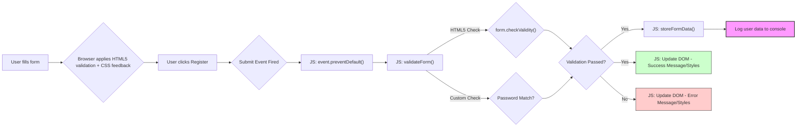

# Project Architecture: Awesome Kartikey Form Validator

## 1. Overview

This project is a simple, client-side web application designed to validate a user sign-up form. It consists of three core files (HTML, CSS, JavaScript) that work together within the user's web browser. There is no server-side component or backend logic involved. The architecture focuses on separating structure (HTML), presentation (CSS), and behavior (JavaScript).

## 2. Folder Structure

The project follows a flat structure, common for small frontend projects:

```
form-validator/
│
├── index.html       # The main HTML file containing the form structure.
├── style.css        # CSS file for styling the form and page elements.
└── script.js        # JavaScript file handling validation logic and DOM manipulation.
```

- **`index.html`**: Defines the form elements, labels, input types, and basic HTML5 validation attributes (`required`, `pattern`, etc.). It links to the `style.css` and `script.js` files.
- **`style.css`**: Contains all the styling rules for the page body, container, form elements (inputs, labels, button), and feedback messages. It uses CSS pseudo-classes like `:valid` and `:invalid` for visual feedback on input fields.
- **`script.js`**: Implements the dynamic behavior. It listens for the form submission event, validates the form using both the HTML5 Constraint Validation API and custom checks (password matching), manipulates the DOM to display feedback (messages, border colors), and logs the form data to the console upon successful validation.

## 3. Major Components

- **HTML Form (`index.html`)**:
  - Uses standard form elements (`<form>`, `<label>`, `<input>`, `<button>`).
  - Leverages HTML5 input types (`text`, `tel`, `email`, `url`, `password`) for semantic meaning and basic browser validation/UI features.
  - Employs HTML5 validation attributes (`required`, `pattern`, `minlength`, `maxlength`) as the first line of validation defence.
  - Includes a dedicated container (`div.message-container`) to display validation feedback messages.
- **CSS Styling (`style.css`)**:
  - Provides layout (using Flexbox to center the form).
  - Styles form elements for visual appeal and consistency.
  - Uses `:valid` and `:invalid` pseudo-classes to give immediate visual feedback on input fields based on their HTML5 validity state.
  - Defines styles for error/success states (e.g., red/green border colors applied via JavaScript or CSS directly).
- **JavaScript Logic (`script.js`)**:
  - **Event Handling:** Attaches an event listener to the form's `submit` event.
  - **Validation Core (`validateForm` function):**
    - Checks overall form validity using `form.checkValidity()`.
    - Performs custom validation logic (comparing password fields).
    - Updates global flags (`isValid`, `passwordsMatch`).
  - **DOM Manipulation:** Updates the text content and styles (color, border color) of the message container and input fields to provide user feedback.
  - **Data Handling (`storeFormData` function):** Retrieves values from the form fields and logs them as an object to the console (simulating data processing).
  - **Control Flow (`processFormData` function):** Orchestrates the validation and pseudo-submission process, preventing the default form submission.

## 4. Data Flow

The data flow is entirely client-side and triggered by user interaction:

1.  **User Interaction:** The user fills out the form fields in the browser.
    - As the user types, the browser applies basic HTML5 validation, and CSS (`:valid`/`:invalid`) provides instant border color feedback on individual fields.
2.  **Form Submission:** The user clicks the "Register" button.
3.  **Event Trigger:** The `submit` event is fired on the `<form>` element.
4.  **Prevent Default:** `event.preventDefault()` in `script.js` stops the browser's default form submission behavior (which would typically cause a page reload or navigation).
5.  **Validation Execution (`validateForm`):**
    - `form.checkValidity()` is called to evaluate all HTML5 constraints.
    - Password and Confirm Password fields are compared.
    - Results are stored in `isValid` and `passwordsMatch` variables.
6.  **Feedback Update:** Based on the validation results:
    - The message in `.message-container` is updated (`textContent` and `style.color`).
    - The border color of the message container and password fields are potentially updated (`style.borderColor`).
7.  **Conditional "Submission" (`processFormData`):** If `isValid` and `passwordsMatch` are both `true`:
    - The `storeFormData` function is called.
    - Form data is read from the input fields.
    - A user object is created.
    - The user object is logged to the browser's developer console.



_Diagram Note: Mermaid syntax rendered above describes the flow._

## 5. Design Decisions

- **Leverage HTML5 Validation:** Using built-in browser validation reduces the amount of JavaScript needed for basic checks and improves performance. It also provides some accessibility benefits out-of-the-box.
- **Vanilla JavaScript:** Chosen for simplicity and to avoid external dependencies for this fundamental task. Demonstrates core web platform features.
- **Progressive Enhancement:** The form relies on HTML5 validation first. JavaScript adds checks (password matching) and improved feedback that HTML/CSS alone cannot provide. The form is still somewhat functional even if JavaScript fails (though password matching and clear messages would be lost).
- **CSS for Instant Feedback:** Using `:valid` and `:invalid` provides immediate visual cues to the user without waiting for form submission or complex JavaScript event listeners on every input.
- **Clear Separation:** Maintaining separate files for HTML, CSS, and JS adheres to the principle of separation of concerns, making the code easier to understand and maintain.
- **Console Logging for Demo:** Instead of implementing complex AJAX/Fetch logic to send data to a non-existent backend, `console.log` is used as a simple placeholder to show that the data _could_ be processed upon successful validation.
